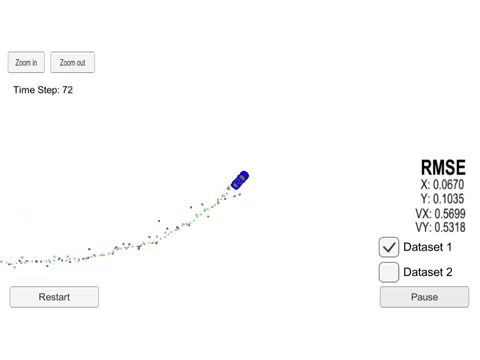

# Extended Kalman Filter

# Objective
> Utilize a kalman filter to estimate the state
of a moving object of interest with noisy lidar and radar measurements.
Passing the project requires obtaining RMSE values that are lower than
the tolerance outlined in the project rubric.

# What I Learned
> - Bayes Theorm
> - Sensor Fusion: Radar and Lidar
> #### Languages
> - C++

# Included Files
> - [Extended Kalman Filter](src/kalman_filter.cpp)